# Runtime Evidence Pack

## Audit Log Service Assignment

**Application:** Tamper-Evident Audit Log Service  
**Assignment:** Build an AI-Assisted Software Engineering System — Audit Log Service  
**Evidence date:** 2026-08-23  
**Runtime:** Spring Boot application with relational database persistence  
**Evidence data:** Synthetic test data only  

> **Confidentiality and data handling:** This evidence pack contains only synthetic test records. Before committing screenshots, redact passwords, tokens, connection strings, personal email addresses, machine-specific sensitive paths, and any other secret or personal information.

## Purpose

This document provides runtime evidence for the core audit-log capabilities and the compliance/RBAC extension. Each section describes the action performed, the expected behavior, and the screenshot that should be committed with it.

Store screenshots under `docs/evidence/screenshots/` and ensure the file names match the links below.

## Environment Evidence

### E-01 — Application startup

**Action:** Start the Spring Boot application locally.

**Expected result:** The application completes startup successfully and listens on the configured port.

**Evidence:**

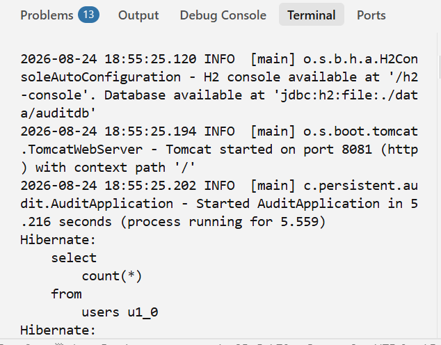

**What this proves:** The service is runnable end-to-end in the local development environment.

---
## DB before execution:

**Event Table:**

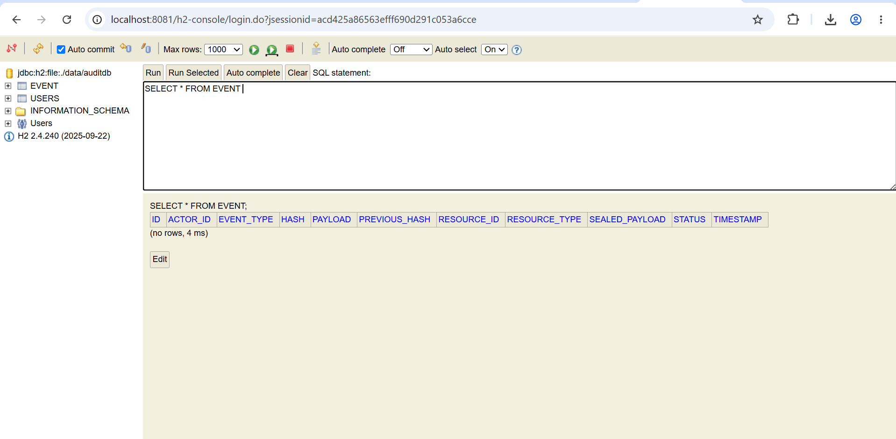


**Users Table:**

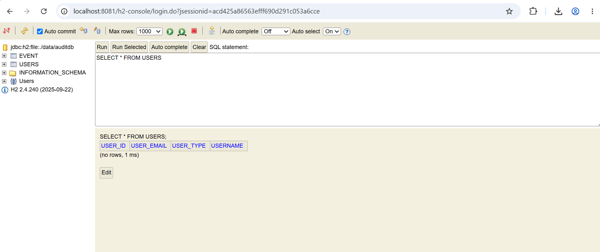


**Insert Test Data into Users table:**

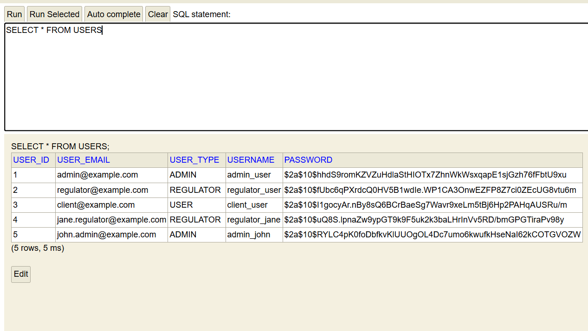


## Scenario A — Core Audit Log

### E-02 — First event creation

**Action:** Send an ADMIN-authorized `POST /audit/createEvent` request.

**Example request body:**

```json
{
  "eventType": "USER_LOGIN",
  "actorId": "A1234",
  "resourceType": "webapp",
  "resourceId": "R1234",
  "payload": "{'userName':'u1','action':'loggedin'}"
}
```

**Expected result:** The API returns `201 Created`, an event ID, and the calculated event hash.

**Evidence:**

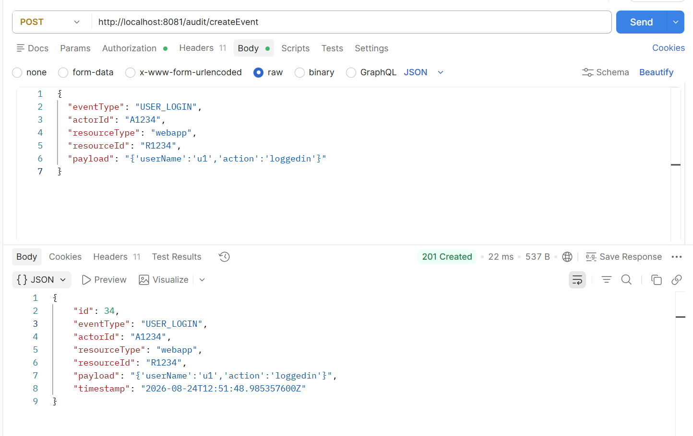

**What this proves:** The service accepts an audit event.

### E-03 — Second event creation

**Action:** Send a second ADMIN-authorized `POST /audit/createEvent` request.

**Expected result:** The API returns `201 Created`. The new event is created after the first event and uses the predecessor hash internally.

**Evidence:**

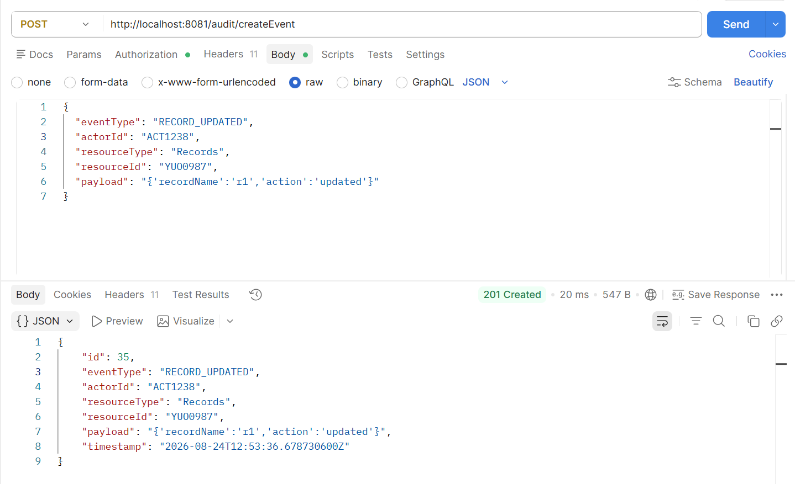

**What this proves:** The service can append multiple events to the chain.

### Event Creation with a normal user not an Admin
**Action:** Send a second ADMIN-authorized `POST /audit/createEvent` request.

**Expected result:** The API returns `403 Access Forbidden`.

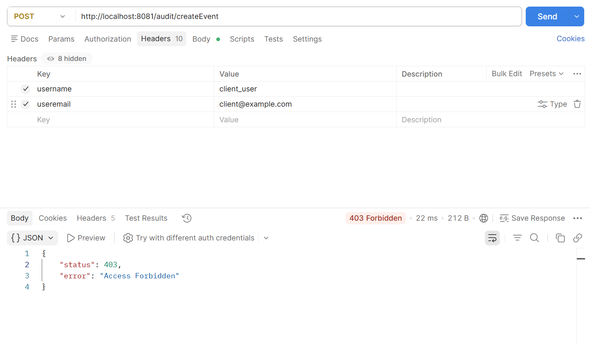


### Event table after creating events:

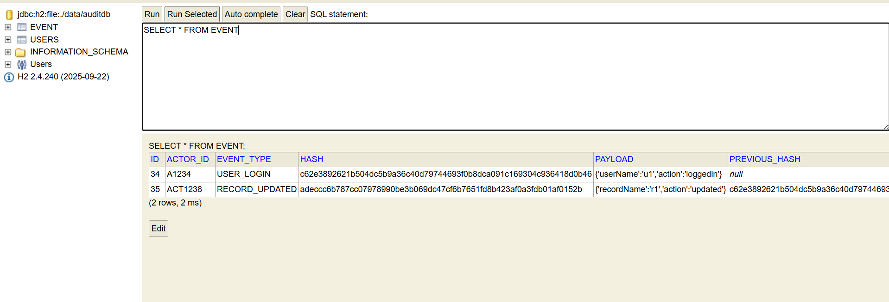

### E-04 — Filtered and paginated event query

**Action:** Call `GET /audit/events` with one or more filters and, where implemented, a page parameter.

**Example:**

```text
GET /audit/events?eventType=A1234&actorId&resourceType&resourceId&fromTimestamp&toTimestampeventType=USER_LOGIN&actorId&resourceType&resourceId&fromTimestamp&toTimestamp
```

**Expected result:** The response returns the matching page of event records. The visible payload does not expose internal `sealedPayload`, salts, or leaf hashes.

**Evidence:**

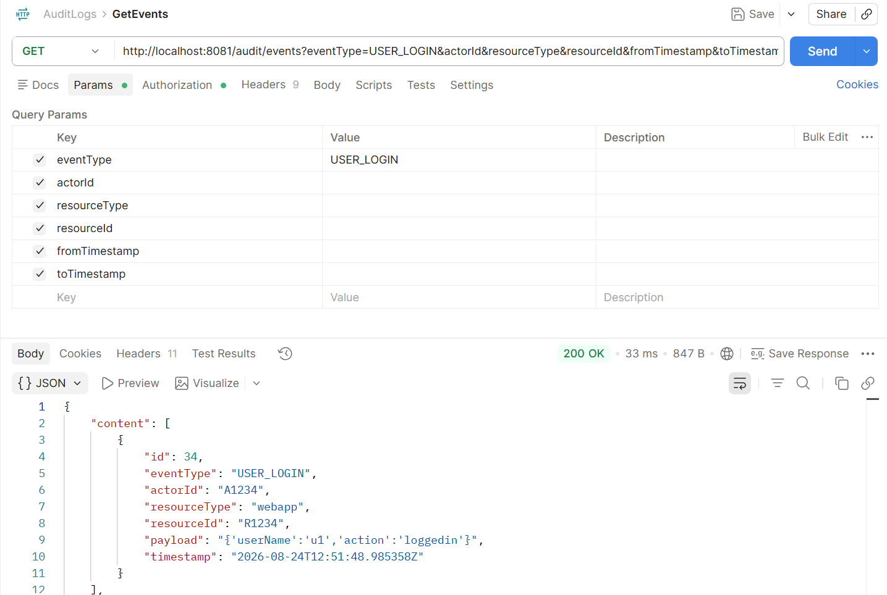

**What this proves:** The query API supports event retrieval and the public response excludes internal integrity metadata.

### Query events without any filer

**Action:** Call `GET /audit/events` with one or more filters and, where implemented, a page parameter.

**Example:**

```text
GET /audit/events?eventType=&actorId&resourceType&resourceId&fromTimestamp&toTimestamp
```

**Evidence:**

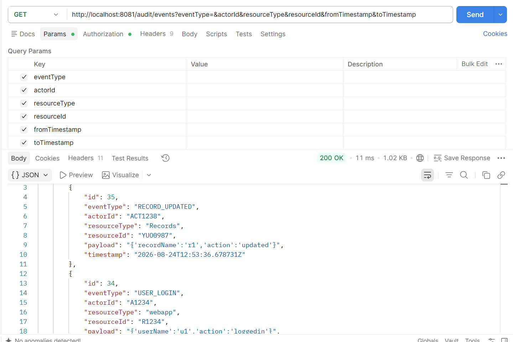


### E-05 — Chain is intact before tampering

**Action:** Call `GET /audit/verify` after creating events and before making any direct database changes as an Admin.

**Expected result:** The response reports an intact chain; no invalid record ID is returned.

**Evidence:**

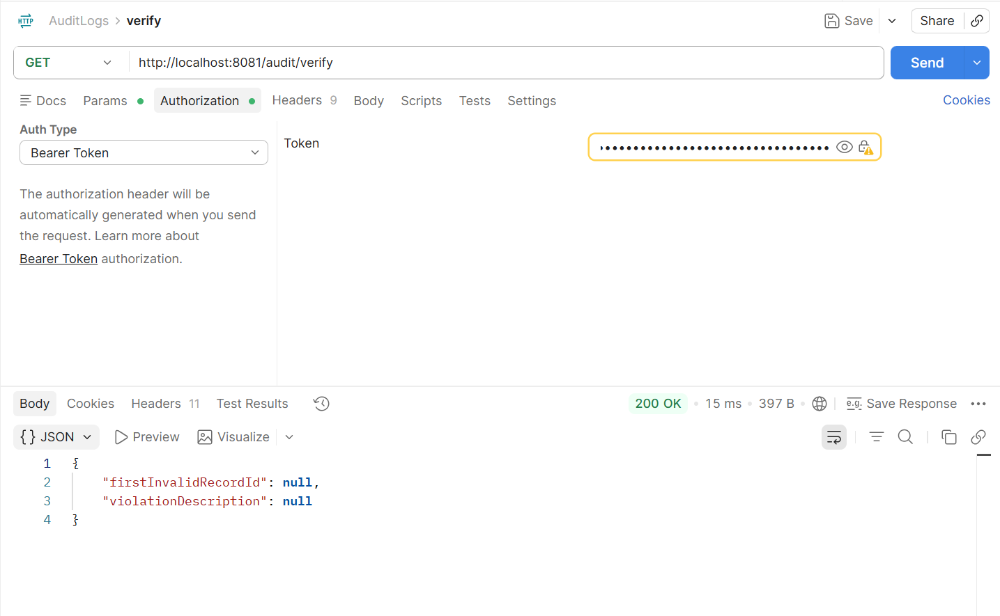

**What this proves:** Recalculation from stored values matches the stored event hashes and predecessor links for an unchanged chain.

### Call Verify as a Regulator

**Action:** Call `GET /audit/verify` after creating events and before making any direct database changes as a Regulator.

**Expected result:** The response reports Access Forbidden.

**Evidence:**

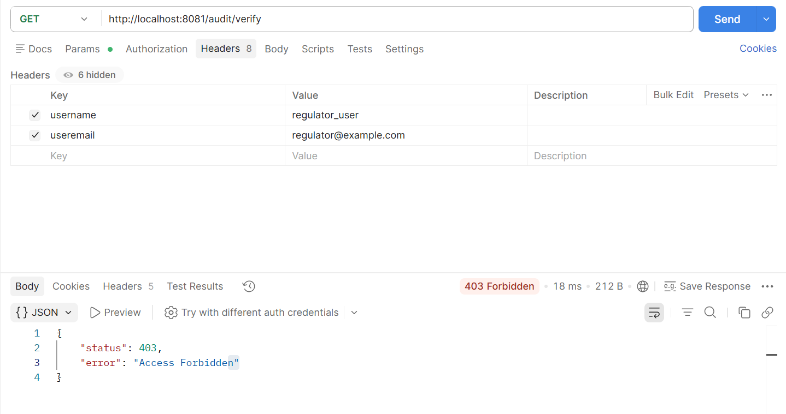


### E-06 — Direct database modification

**Action:** Modify a protected historical event value directly in the database, without updating `hash`, `previous_hash`, or the internal sealed integrity representation.

**Example validation-only SQL:**

```sql
UPDATE event
SET actor_id = 'B123'
WHERE id = 1;;
```

**Expected result:** The database row changes, but the stored event hash does not change.

**Evidence:**

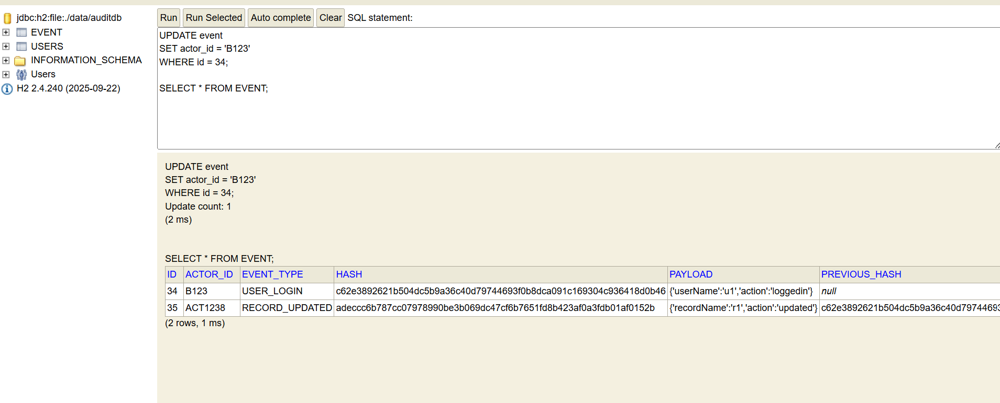

**What this proves:** The validation simulates unauthorized modification that bypasses the application API.

### E-07 — Direct tampering is detected

**Action:** Call `GET /audit/verify` after the direct database modification.

**Expected result:** The response identifies the first affected record and reports `EVENT HASH MISMATCH` or the appropriate violation type.

**Evidence:**

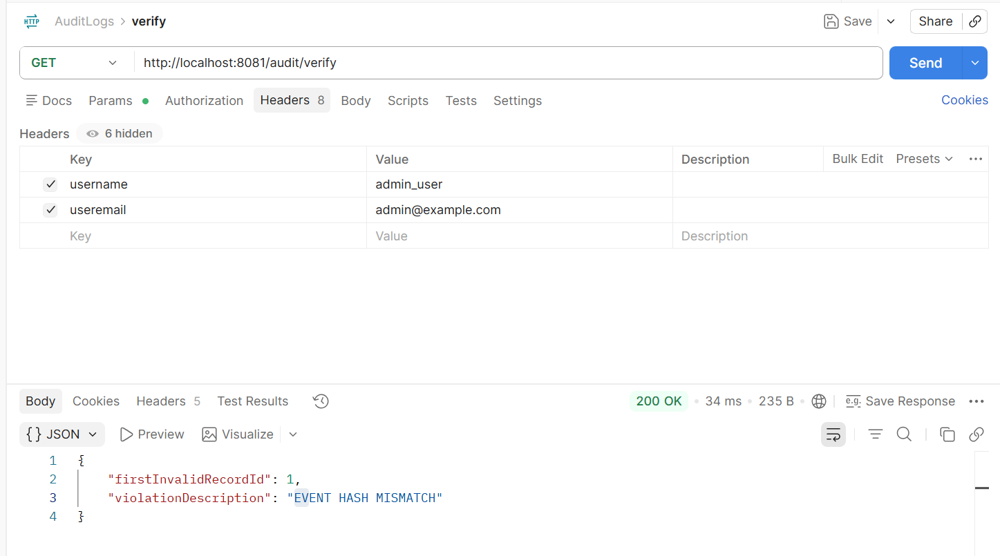

**What this proves:** The verification endpoint recalculates the event hash from current data-store values and detects historical tampering.

---

## Scenario B — Retention, Redaction, and Export

### Update the timestamp of any record

**Action:** Modify the timestamp of a record to 2025

**Example validation-only SQL:**

```sql
UPDATE event
SET timestamp = '2025-08-23 09:54:11.818703+00'
WHERE id = 1;
```

**Expected result:** The database row changes, but the stored event hash does not change.

**Evidence:**

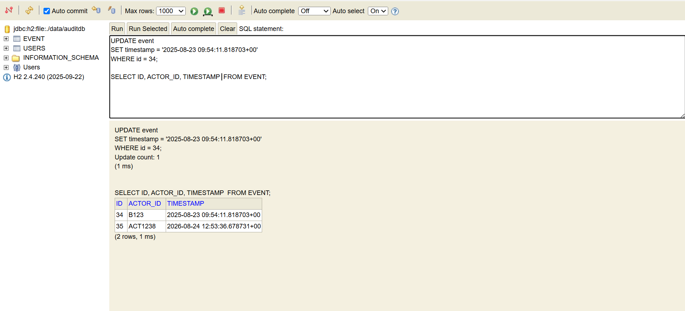

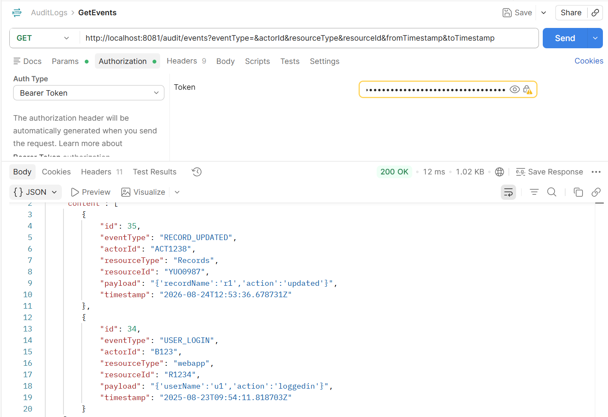

### E-08 — Retention archival

**Action:** Call the ADMIN-authorized retention endpoint with a positive retention window.

**Example:**

```text
PUT /audit/checkForRetention?days=30
```

**Expected result:** Events older than the cutoff are marked `ARCHIVED` according to the configured retention policy.

**Evidence:**

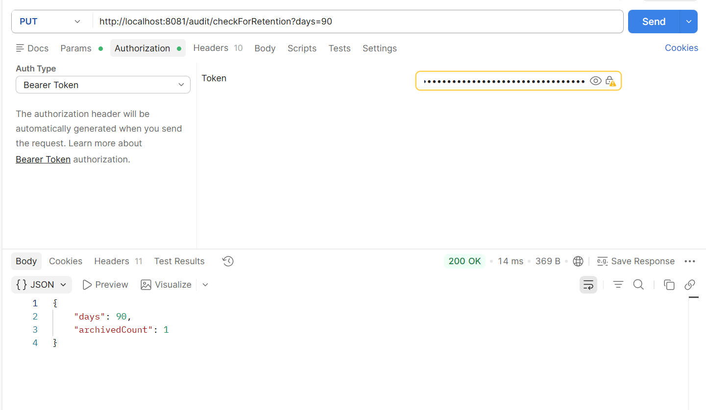


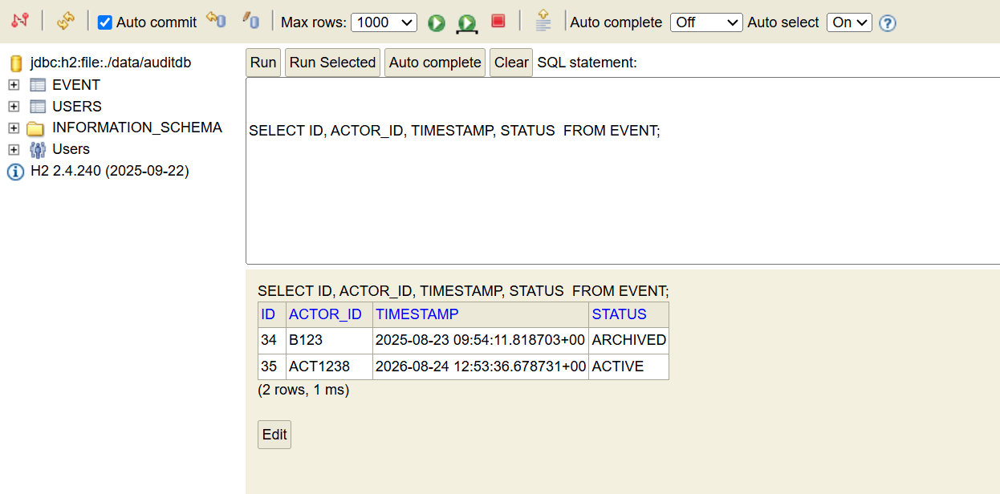


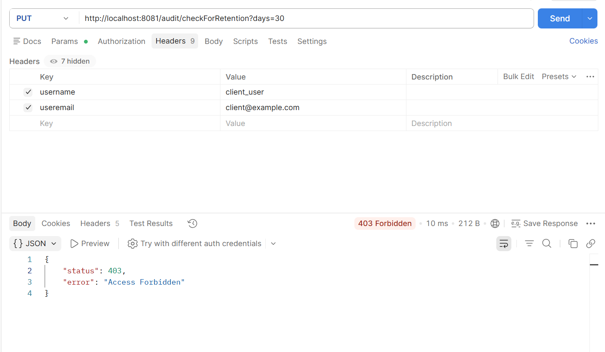


**What this proves:** The service performs a soft archival action rather than deleting chain records.


### E-10 — Authorized sensitive-field redaction

**Action:** As we have already modified the DB to verify the chain. clear the db and create 2 new events with sensitive fields, then call the ADMIN-authorized redaction endpoint.

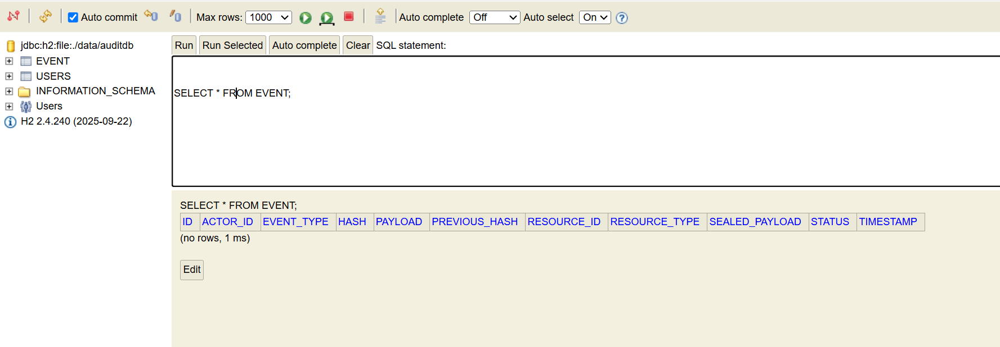


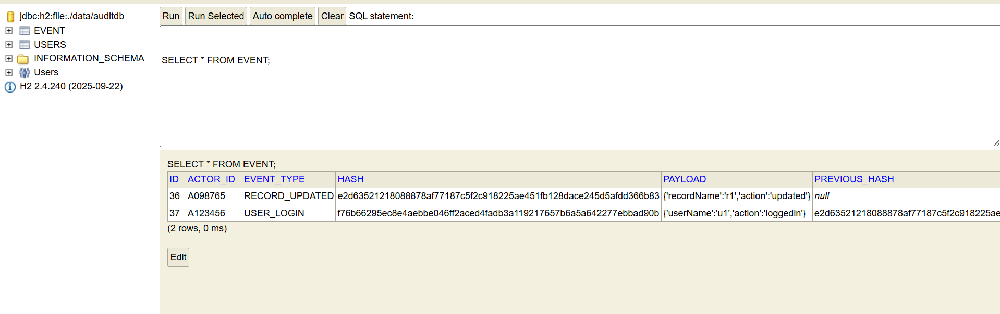


**Example:**

```text
PUT /audit/redact?id=3&fields=userName
```

**Expected result:** The selected visible payload field becomes `null`. The event hash remains unchanged because internal integrity metadata is preserved in `sealedPayload`.

**Evidence:**

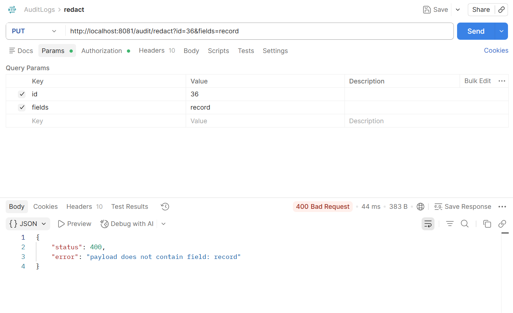

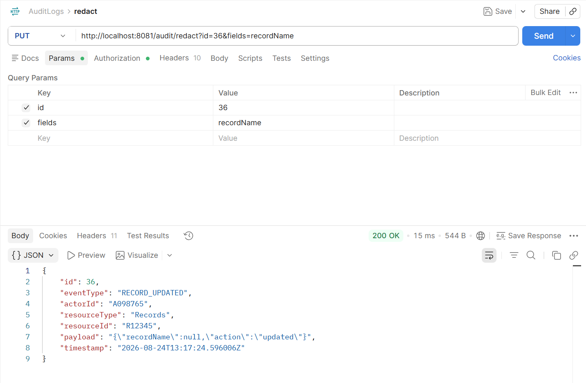

**What this proves:** The application can remove visible sensitive values through an authorized operation.

### E-11 — Chain remains intact after redaction

**Action:** Call `GET /audit/verify` after redacting a sensitive field.

**Expected result:** The chain remains intact and the redacted record does not report a hash mismatch.

**Evidence:**

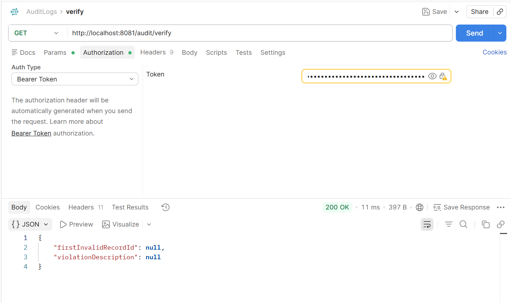

**What this proves:** Redaction preserves the original payload-root integrity evidence and does not break the hash chain.

### E-12 — Export CSV bundle

**Action:** Call the ADMIN- or REGULATOR-authorized export endpoint for an actor or resource.

**Example:**

```text
GET /audit/export?actorId=A1234
```

**Expected result:** The response has `Content-Type: text/csv` and a `Content-Disposition` attachment header for `Event_Bundle.csv`. The body contains CSV rows including chain metadata.

**Evidence:**

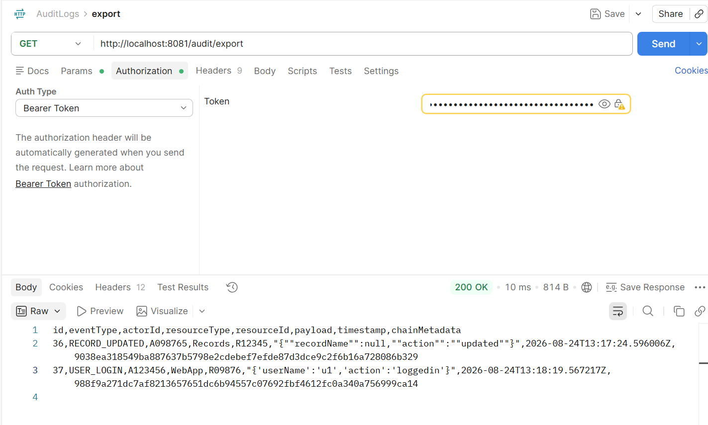

**What this proves:** The service can provide a portable event bundle. Postman may display CSV content inline; use “Send and Download” or “Save Response” to save it as a `.csv` file.


